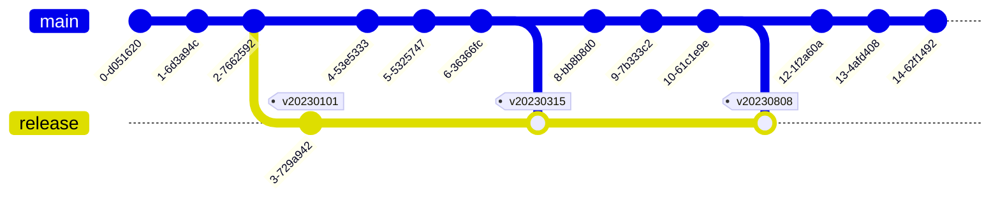
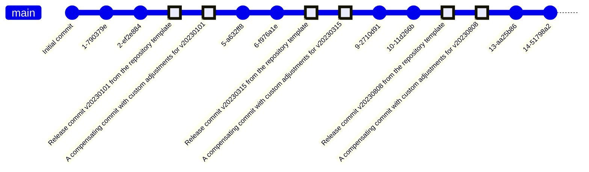

# Branching strategy

## Repository template

```mermaid
gitGraph
  commit
  commit
  commit
  branch release
  commit tag: "v20230101"
  checkout main
  commit
  commit
  commit
  checkout release
  merge main tag: "v20230315"
  checkout main
  commit
  commit
  commit
  checkout release
  merge main tag: "v20230808"
  checkout main
  commit
  commit
  commit
```

## Target repository

```mermaid
gitGraph
   commit id: "Initial commit"
   commit
   commit
   commit id: "Release commit v20230101 from the repository template" type:HIGHLIGHT
   commit id: "A compensating commit with custom adjustments for v20230101" type:HIGHLIGHT
   commit
   commit
   commit id: "Release commit v20230315 from the repository template" type:HIGHLIGHT
   commit id: "A compensating commit with custom adjustments for v20230315" type:HIGHLIGHT
   commit
   commit
   commit id: "Release commit v20230808 from the repository template" type:HIGHLIGHT
   commit id: "A compensating commit with custom adjustments for v20230808" type:HIGHLIGHT
   commit
   commit
```
